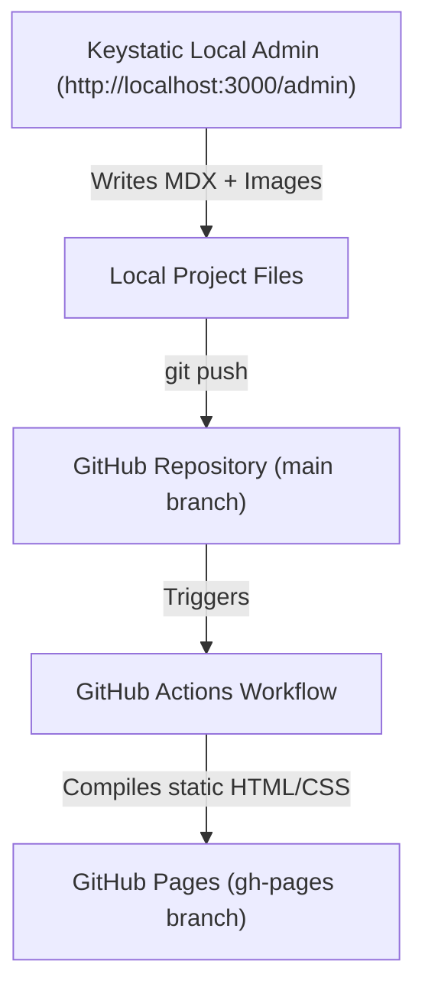

# Architecture Spine — Lucas Souza - Blog

## Design Paradigm

The system follows a **Static Site Generation (SSG)** paradigm combined with a **Local-First Git-based Content Management System (CMS)**. The frontend framework generates 100% static HTML at build time, while the CMS runs locally on the developer's machine as a visual editor, outputting raw Markdown/MDX files directly into the repository.

The deployment flow is represented below:



## Invariants & Rules

### AD-1 — Zero-Cost Hosting & Delivery
- **Binds:** `all`
- **Prevents:** Hosting cost surprises, backend server dependencies, and platform-as-a-service lock-in.
- **Rule:** The production blog must be hosted entirely on GitHub Pages, utilizing automated GitHub Actions workflows to compile Astro. No serverless functions, databases, or runtime servers are permitted in the production environment.

### AD-2 — Local-First Content Management
- **Binds:** `src/content/`, `keystatic.config.ts`
- **Prevents:** Hosted CMS database fees, external API downtime, and sync issues.
- **Rule:** Content creation must be managed via Keystatic in Local Mode (available under `localhost:3000/admin` in development). The CMS must write articles and upload media directly to the local repository as MDX files and static assets. No online database or cloud CMS authentication servers are allowed for content authoring.

### AD-3 — Semantic and Performance-First Rendering
- **Binds:** `src/pages/`
- **Prevents:** Heavy client-side JavaScript bundles and low SEO scores.
- **Rule:** All pages must render to static HTML at build time. Client-side JavaScript must be kept minimal (limited to theme toggling, interactive navigation, and copying code blocks). Astro's server-rendered components must be used, sending zero JS to the browser by default.

### AD-4 (NFR) — Accessibility and Visual Alignment
- **Binds:** `src/layouts/`, `src/components/`
- **Prevents:** UI inconsistency with DESIGN.md and contrast failures.
- **Rule:** All styling must implement the custom CSS variable tokens defined in `DESIGN.md`. Font styles, colors, layouts, and components must adhere to the Minimalist style rules. Elements must maintain WCAG 2.1 AA compliant contrast ratios against backgrounds.

## Consistency Conventions

| Concern | Convention |
| --- | --- |
| **Post file naming** | Articles must be stored as slugified kebab-case MDX files: `src/content/posts/{slug}.mdx`. |
| **Post assets** | Images uploaded for articles must be saved under: `src/assets/posts/{slug}/`. |
| **Astro component structure** | UI components must be created as PascalCase `.astro` files: `src/components/{ComponentName}.astro`. |
| **Astro routing** | Standard static pages must map directly to filenames: `index.astro`, `projects.astro`, `about.astro`. Post detail pages must use dynamic routes: `posts/[slug].astro`. |

## Stack

| Name | Version |
| --- | --- |
| **Astro** | `^4.16.0` |
| **Keystatic** | `^0.5.0` |
| **React** | `^18.3.0` (required as a peer dependency for Keystatic configuration) |
| **TypeScript** | `^5.0.0` |

## Structural Seed

```text
{root}/
  .github/workflows/
    deploy.yml          # GitHub Actions workflow for static build and deploy
  public/               # Static assets (favicons, robots.txt)
  src/
    assets/             # Global styles (index.css), custom fonts, and post media
      posts/            # Subfolders of post-specific assets
    components/         # Astro layout components (Sidebar, Header, PostCard, search modal)
    content/
      config.ts         # Astro content collection definitions
      posts/            # Raw .mdx article files
    layouts/
      Layout.astro      # Main page HTML wrapper integrating DESIGN.md visual tokens
    pages/
      index.astro       # Blog Home (up to 3 cards per row)
      projects.astro    # Portfolio Projects page
      about.astro       # About / Contact page
      posts/
        [slug].astro    # Article post detail view
  keystatic.config.ts   # Keystatic Local Mode configuration
  package.json
  tsconfig.json
```

## Deferred

- **Custom Domain Setup:** Configuring custom CNAME records on the DNS provider can wait until the initial deploy to `*.github.io` is complete.
